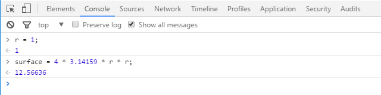
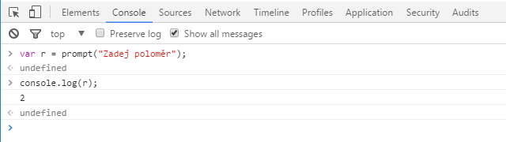

#Kód
Zdrojový kód se skládá ze sady instrukcí zpracovávaných počítačem. V případě 
JavaScriptu jsou přímo vykonávány - interpretovány. 

## Příkazy
Příkaz (_statement_) je skupina slov, čísel a operátorů, které vykonávají určitý
úkol.

V následující ukázce se do proměnné `surface` uloží výsledek výpočtu povrchu 
koule o poloměru definovaném v proměnné `r`.

```JavaScript
surface = 4 * 3.14159 * r * r;
```

 * `surface`, `r` - proměnné (_variables_) sloužící k uchování hodnot používaných programem
 * `4` a `3.14159` - hodnoty (_literal value_), existují samostatně bez uložení v proměnných
 * `=` a `*` - operátory (_operators_) - provádějí akce s proměnnými a hodnotami
 * Většina příkazů v JavaScriptu je zakonečna středníkem (`;`).
 
## Výrazy
Příkazy jsou tvořeny jedním nebo více výrazy (_expression_). Výraz je jakýkoliv 
odkaz na proměnnou nebo hodnotu (nebo jejich skupinu) kombinovaný s operátory.

Příkaz z předchozí ukázky obsahuje několik výrazů:
 * `4` a `3.14159` - _literal value expression_
 * `r` - _variable expression_ - vrací aktuální hodnotu proměnné
 * `4 * 3.14159 * r * r` - _arithmetic expression_ - násobení
 * `surface = 4 * 3.14159 * r * r` - _assignment expression_ - přiřazuje hodnotu násobení (výsledek _arithmetic expression_) do proměnné

Obecný výraz použitý samostatně se nazývá _expression statement_,
```JavaScript
2 * r;
```

který ovšem nemá vliv na program, hodnota výrazu není použita. Mnohem běžnější
použití je _call expression statement_ - zavolání funkce.
```JavaScript
circumference(r);
```
##Spuštění programu
JavaScript je interpretovaný jazyk. Pro spuštění tak vyžaduje běhové prostředí.
Tím může být webový prohlížeč (Internet Explorer, Firefox, Chrome...), nebo 
jiné běhové prostředí, např. [Node.js](https://nodejs.org/).

Pro otevření vývojářské konzole v prohlížeči by měla fungovat klávesová zkratka
**F12**, anebo si prostě najděte vývojářskou konzoli v menu svého prohlížeče.
Napište příkaz, potvrďte, a je to, první kód v JS.



Vstup uživatelských dat do konzole je možné pomocí zavolání funkce `prompt()`,
která zobrazí dialogové okno pro zápis hodnoty. Výpis aktuálně zadané hodnoty
lze získat funkcí `console.log()`.



##Operátory
Operátory představují akce s proměnnými, nebo hodnotami. Operátor rovnítko `=`
se používá pro přiřazení hodnoty na pravé straně do proměnné uvedené na levé
straně.
```JavaScript
r = 2;
surface = 4 * 3.14159 * r * r; 
```

Mezi nejčastěji používané operátory patří:
 * _přiřazení_ - `=`, např. `r = 2`
 * _matematické_ - `+` (sčítání), `-` (odčítání), `*` (násobení), `/` (dělení), např. `r * 2`
 * _porovnání_ - `==` (rovnost), `===` (striktní rovnost), `!=` (nerovnost), `!==` (striktní nerovnost), např. `r === 2`
 * _rovnost_ - `<` (menší než), `<=` (menší nebo rovno), `>` (větší), `>=` (větší nebo rovno), např. `r > 1`
 * _logické_ - `&&` (logický součin - AND), `||` (logický součet - OR), např. `r > 1 && r < 3`
 * _přistup k vlasnosti objektu_ - `.`, např. `console.log()`
 * _unární_ - `delete`, `typeof`, `instanceof`, např. `typeof r` 
 * _podmínkové (ternární)_ - `condition ? val1 : val2`, např. `typeof r === "number" ? r : parseInt(r, 10)`

Priorita operátorů určuje, v jakém pořadí jsou aplikovány, viz
[MDN - Operator precedence](https://developer.mozilla.org/en-US/docs/Web/JavaScript/Guide/Expressions_and_Operators#Operator_precedence).

Pro úplný výčet operátorů s příklady viz 
[MDN - Expressions and operators](https://developer.mozilla.org/en-US/docs/Web/JavaScript/Reference/Operators).

##Hodnoty a typy
Každá hodnota, s níž se v kódu pracuje, má typ. Ten pomáhá k upřesnění operací,
jež lze s danou hodnotou provádět. I v reálném životě se sčítají a odčítají
čísla, tvoří slova pomocí předpon a přípon, či odpovídá prostým ano/ne.

JS má typ pro každou takovou tzv. primitivní hodnotu, jimiž jsou:
 * čísla - `number`, např. `1`, `2`, `3.14159`
 * řetězce - `string`, např. `"a"`, `"abc"`, `"Ahoj sluníčko :)"` 
 * logické - `boolean`, hodnoty `true` a `false`

Jsou-li hodnoty použity napřímo, hovoříme o _literálech_. Řetězcové literály
`string` jsou zapisovány s dvojitými (`"a"`), nebo jednoduchými (`'a'`)
uvozovkami. Rozdíl je pouze stylistický, lze používat oboje, z hlediska
čitelnosti se doporučuje používat jednu formu.
```JavaScript
r = 2;
sphere = true;
animal = "wombat";
```
Kromě primitivních hodnot pracuje JS také s komplexními typy (pole, objekty,
funkce...), které budou popsány dále.
##Konverze typů
Konverze typů umoňuje převádět hodnoty do formy, která je nutná pro další
operace. Vrátíme-li se k ukázce získání vstupu  (poloměr koule) od uživatele,
```JavaScript
r = prompt("Zadej poloměr");
```
zjistíme pomocí operátoru `typeof`, že hodnota v proměnné `r` není číslo, ale
řetězec.
```JavaScript
console.log(typeof r);    // 'string'
```
Pro výpočet potřebujeme, aby hodnota byla typu `number`, čehož docílíme
konverzí. 
```JavaScript
r = parseInt(r, 10);
```
Nyní je v proměnné `r` uložena hodnota typu `number`.
```JavaScript
console.log(typeof r);    // 'number'
```
Pokud bychom chtěli získat místo celého čísla desetinné, můžeme použít
```JavaScript
r = parseFloat(r);
```
anebo
```JavaScript
r = Number(r);
```
Způsobů může být více. Řada konverzí probíhá v JS implicitně.

_Tabulka implicitních konverzí_

Hodnota | `number` | `string` | `boolean`
-------- | -------- | -------- | ---------
`false` | `0` | `"false"` | `false`
`true` | `1` | `"true"` | `true`
`0` | `0` | `"0"` | `false`
`1` | `1` | `"1"` | `true`
`"0"` | `0` | `"0"` | `true`
`"000"` | `0` | `"000"` | `true`
`"1"` | `1` | `"1"` | `true`
`NaN` | `NaN` | `"NaN"` | `false`
`Infinity` | `Infinity` | `"Infinity"` | `true`
`-Infinity` | `-Infinity` | `"-Infinity"` | `true`
`""` | `0` | `""` | `false`
`"20"` | `20` | `"20"` | `true`
`"twenty"` | `NaN` | `"twenty"` | `true`
`[]` | `0` | `""` | `true`
`[20]` | `20` | `"20"` | `true`
`[10, 20]` | `NaN` | `"10,20"` | `true`
`["twenty"]` | `NaN` | `"twenty"` | `true`
`["ten, "twenty"]` | `NaN` | `"ten,twenty"` | `true`
`function(){}` | `NaN` | `"function(){}"` | `true`
`{}` | `NaN` | `"[object Object]"` | `true`
`null` | `0` | `"null"` | `false`
`undefined` | `NaN` | `"undefined"` | `false`

##Komentáře v kódu
Kód se jednou píše a stokrát čte. Ačkoliv se názory na komentáře v kódu různí,
pravdou je, že kód se píše pro lidi. Čas od času i sebelepší programátor
potřebuje pochopit _proč_ je to právě tak. Komentáře jsou součástí kódu.

V JS je možné použít komentáře
 * řádkové      `// řádkový komentář`
 * blokové      `/* blokový komentář */`

Rozdíl mezi nimi spočívá v tom, že zatímco řádkový komentář komentuje oblast od
svého zápisu až na konec řádky, blokový dokáže komentovat pouze část řádky
stejně jako celý blok textu.
```JavaScript
r = 1;      // jednotková kružnice
```
```JavaScript
r = /*prompt("Zadej poloměr kružnice")*/ 1;
surface = 4 * 3.14159 * r * r;
```
Interpret komentáře ignoruje, tedy cokoliv co je uvedeno uvnitř nemá vliv na běh
programu.
##Proměnné
Proměnné slouží k uložení a přenosu hodnoty. Lze na ně jednoduše pohlížet jako
na symbolický pojmenovaný kontejner. Vzhledem k tomu, že JS je dynamicky
typovaný jazyk, může proměnná v čase obsahovat různé typy hodnot. Naopak ve
staticky typovaném jazyce může proměnná sice obsahovat různá data, ale vždy
téhož typu.

Proměnná je deklarována pomocí _klíčového_ slova `var`. 
```JavaScript
var r = 2;
var surface;

surface = 4 * 3.14159 * r * r;
```
Práce s proměnnými je totožná s prací s hodnotami, jejím použitím ve výrazu
používáme hodnotu, kterou uchovává. Pro proměnné uchovávající primitivní datové
typy platí stejná pravidla, jako pro konverzi takových hodnot.
```JavaScript
var r = prompt("Zadej poloměr");
    
r = parseInt(r);
console.log(typeof r);    // 'number'
```
##Bloky
Bloky představují sadu příkazů uzavřených ve složených závorkách `{...}`, které 
jsou vykonáváný společně. V JS se samostatně nepoužívají, neboť nevytváří obor
platnosti (o tom bude pojednádno dále), ale svoje uplatnění nachází například u
podmínek nebo cyklů.

##Podmínky
Rozhodování (větvení kódu) se děje pomocí podmínek. Nejběžněji se vyskytuje
konstrukce `if`, která vyžaduje logický výraz s výsledkem ano/ne (`true`,
`false`). Pokud je výraz vyhodnocen jako pravdivý (`true`), provede se
následující blok kódu.
```JavaScript
if (typeof r === 'string') {
    r = parseInt(r);
}
```
Volitelně může být příkaz doplněn o větev `else`, jejíž blok je vykonán
v případě, že hodnota výrazu v podmínce byla vyhodnocena jako nepravda. 
```JavaScript
if (r > 0) {
    surface = 4 * 3.14159 * r * r;
} else {
    console.log("Moment, zkouším ohnout kružítko.");
}
```
Konstrukce `if` - `else` umožňuje složitější větvení.
```JavaScript
if (r < 0) {
    console.log("Koule není záporný hrdina.");
} else if (r === 0) {
    console.log("Singularita");
} else {
    surface = 4 * 3.14159 * r * r;
}
```

Další možností jak vytvořit podmínku s více větvemi je příkaz `switch`.
```JavaScript
switch (r) {
case NaN:
    console.log("Není číslo.");
    break;
case Infinity:
    console.log("Nekonečno.");
    break;
case 0:
    console.log("Singularita");
    break;
default:
    surface = 4 * 3.14159 * r * r;
    break
}
```
##Smyčky
Projít seznam prvků, provést výpočet pro množinu čísel; smyčky slouží k
opakování sady operací, dokud není splněna podmínka. JS disponuje několika
způsoby jak takovou smyčku provést. Jednou z nich je konstrukce, kde se za
klíčovým slovem `while` nachází logický výraz - podmínka - rozhodující o tom,
zda bude cyklus pokračovat. Pokud je výraz pravidvý (`true`), provede se kód v
bloku `{...}`. Není-li pravdivý (`false`), pokračuje program dále za cyklem.

Následující kód vypíše povrch koulí o poloměrech 1 až 9. 
```JavaScript
r = 1;

while (r < 10) {
    console.log(4 * 3.14159 * r * r);
    r = r + 1;
}
```
Podmínku je možné napsat i jako nekonečnou a cyklus ukončit pomocí příkazu
`break`.
```JavaScript
r = 1;

while (true) {
    if (r < 10) {
        console.log(4 * 3.14159 * r * r);
        r = r + 1;
    } else {
        break;
    }
}
```
Podobnou konstrukcí je `do-while`. Rozdíl mezi oběma spočívá v tom, že v případě
`while` se blok kódu vykoná pouze pokud je podmínka splněna, zatímco u
`do-while` se provede vždy alespoň jednou.
```JavaScript
r = 10;

do {
    console.log(4 * 3.14159 * r * r);   // vypíše 1256.636
    r = r + 1;
} while (r < 10);
```
Další možností je cyklus `for`, který obsahuje tři klauzule oddělené
středníkem (`;`):
 1. inicializační (`r = 1`)
 2. testovací (`r < 10`)
 3. aktualizační (`r++`) 
```JavaScript
for (r = 1; r < 10; r++) {
    console.log(4 * 3.14159 * r * r);
}
```
Z kódu je zřejmé, že `for` cyklus je co do zápisu nejkompaktnější, běžně se
užívá například při procházení polí.
##Funkce
Dosud byl náš kód sérií postupně vykonávaných příkazů. Pokud bychom chtěli
tutéž část použít vícekrát, byli bychom nuceni ji napsat znovu. Tím by utrpěla
čitelnost i udržovatelnost. Funkce umožňuje vytvoření pojmenovaného bloku kódu,
který je možné volat opakovaně. 

```JavaScript
function surfaceAreaOfSphere(r) {
    return 4 * 3.14159 * r * r;
}

console.log(surfaceAreaOfSphere(1));
```
Volitelně je funkce schopna přijímat argumenty (_parametry_) a také vracet
hodnotu. Funkce `surfaceAreaOfSphere` přebírá jako parametr `r` poloměr koule a
vrací její plochu. Předchozí příklad, v němž se vypíše plocha koulí o poloměrech
1 až 9 lze přepsat:

```JavaScript
function power(a) {
    return a * a;
}

function surfaceAreaOfSphere(r) {
    return 4 * 3.14159 * power(r);
}

for (r = 1; r < 10; r++) {
    console.log(surfaceAreaOfSphere(r));
}
```
V ukázce jsme také vytvořili další funkci `power`, jejímž úkolem je vypočítat
druhou mocninu čísla předaného jako paramter. Funkce neslouží pouze k odstranění
duplicit v kódu, ale obecněji k jeho strukturování. Správné rozdělení
odpovědnosti vede k čitelnějšímu kódu.
